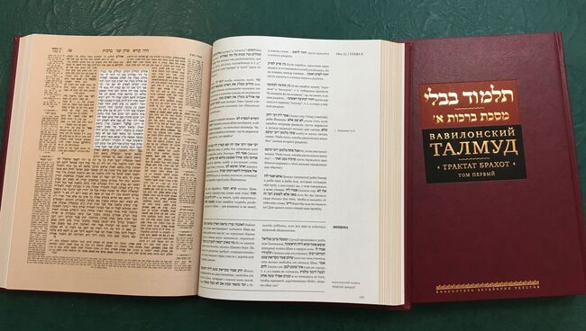

<style>
.twocolumn_01 {
   display: grid;
   grid-template-columns: 4fr 1fr;
   grid-gap: 10px;
   text-align: left;
}
</style>

### №1. Почему на Rust ничего невозможно сделать...
- ... не прочитав какой-нибудь талмуд?
- Иными словами, почему Rust сложный для новичков?
<p></p>
<div class="twocolumn_01">
<div>
<ol>
  <li>Rust <b>действительно</b> новый ЯП</li>
  <li>C++ это улучшенный C, а Java это более безопасный C++</li>
  <li>C# ~ Java, только под диктовку M$</li>
  <li>Python ~ Ruby ~ PHP, динамика и GC</li>
  <li>Golang ~ Java, только с go func и без Ъ ООП</li>
</ol>
</div>
<div>
  
</div>
</div>

---------------------------------------------------------------------------------------------------


### Старые привычки дают сбой
```rust
let x = "Hello".to_string();
do_something(x);
print!("{x}"); // почему он ругается?
```
- `do_something` "поедает" `x`, и это ощущается как неожиданный побочный эффект
---------------------------------------------------------------------------------------------------


### Книжные примеры ООП не работают
```java
abstract class Base {
  void a();
  void b();
}
class A extends Base {
  void a() { println("class A") }
}
class B extends Base {
  void b() { println("class B") }
}
```
- Нет наследования, как делать абстракции? Типажи (traits) работают по-другому
---------------------------------------------------------------------------------------------------


### Заход из ФП тоже сложный

- Есть алгебраические типы!
- Есть классы типов из Haskell!

```haskell
let add x y z = x + y + z
```
но
```rust
fn add(x: i32) -> impl Fn(i32) -> Box<dyn Fn(i32) -> i32> {
    move |y: i32| {
        Box::new(move |z: i32| {
            x + y + z
        })
    }
}
```
???

---------------------------------------------------------------------------------------------------


### Проще всего с C

Правда, есть ньюанс


---------------------------------------------------------------------------------------------------


## Вывод для Почему №1

<style>
.twocolumn_02 {
   display: grid;
   grid-template-columns: 3fr 1fr;
   grid-gap: 10px;
   text-align: left;
}
</style>

<div class="twocolumn_02">
  <div>

- не уничтожайте свой энтузиазм раньше времени! `rustc` будет вас обижать, а вы не будете понимать за что
- пройдите какой-нибудь обучающий материал Rust Book, TMLL, Rustlings
  [rust_beginners_ru/58928](https://t.me/rust_beginners_ru/58928)

  </div>
  <div>   
    
  </div>  
</div>