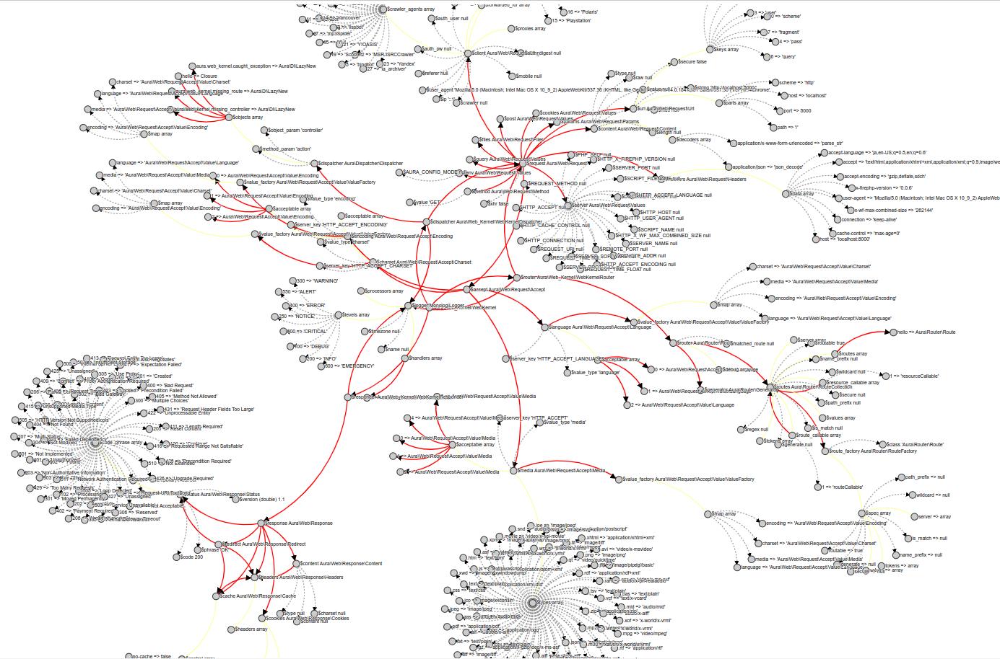
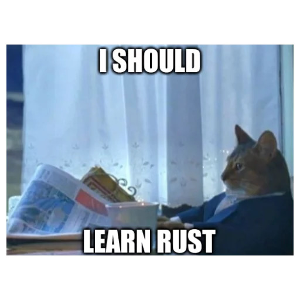
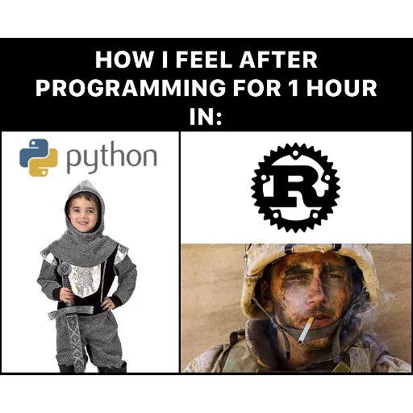

<style>
.twocolumn_06 {
   display: grid;
   grid-template-columns: 2fr 1fr;
   grid-gap: 10px;
   text-align: left;
}
.twocolumn_06_1 {
   display: grid;
   grid-template-columns: 1fr 1fr;
   grid-gap: 10px;
   text-align: left;
}
</style>

### №6 Почему в Раст не завезли ООП

... и как вообще писать без ООП?

**Определение ООП:**
_Подход к созданию программ такой, что
программа рассматривается как множество взаимодействующих объектов,
каждый из которых обладает своим (возможно неуникальным) поведением,
объекты взаимодействуют через посылку сообщений и это единственный способ взаимодействия._

- Есть мнение, что Erlang идеально отражает эту модель
- Когда-то в Расте были и классы, и GC!


#### Как выглядят реальные системы?

1. Объекты суть экземпляры классов, классы принадлежат какой-то иерархии (реализуют интерфейсы)
2. Объекты обладают состоянием в виде набора полей
3. Объекты обладают поведением в виде набора методов, методы **приклеены** к неверсионированному состоянию
4. Объекты ссылаются друг на друга, граф имеет циклы
5. Большинство классов бизнес-логики изменяемы (данные иногда нет)
6. Функциональный подход ограничивается конвертацией коллекций с помощью стримов; TF/FM невозможны
7. Набор методов реализован так, что корректность состояния якобы гарантируется (**всегда ли?**) 


#### Как выглядят реальные системы?




#### Что это значит для Rust?

Создатель Erlang **Джо Армстронг** когда-то сказал так:
<blockquote>
Вы хотели всего лишь банан, а получаете гориллу с бананом, сидящей на пальме, пальму, растущую в джунглях, и целые джунгли в придачу.
</blockquote>

- Нарушается основной инвариант: либо одна _изм._ ссылка, либо множество _неизменяемых_ ссылок
- Типажи не участвуют в наследовании и могут быть реализованы независимо
- Системы типов в ООЯ _ненадёжны_


#### Если не ООП, то как?

1. Вы формулируете описание данных в виде `struct` и `enum`, это структуры данных;
2. Вы определяете функции, которые работают над этими данными, то бишь алгоритмы;
3. Где-то в `main` вы создаёте структуры данных и передаёте их в функции в нужном порядке, вуаля!
<div class="twocolumn_06">
<div style="padding: 30px">
    Подождите-ка, это что, <b>процедурное программирование</b>?!
</div>
<div>
    
</div>
</div>


#### Процедурное программирование, но типобезопасное!

1. В ООП классы скрывали состояние, чтобы обезопасить его. В Rust это достигается
   видимостью на уровне модуля и владением!
2. Методы классов распадаются на: методы, ассоциированные с данными, методы типажей и внешние функции
3. Наследования реализации нет, для типажей есть "наследование" cигнатур функций
4. Функции, типажи и данные могут быть обобщёнными


#### Пример

<div style="text-align: left">

Определены типы данных `NewsArticle` и `SocialPost`, независимо от них типаж `Summary`, 
и обобщённые функции `notify` и `notify_dyn` используют этот типаж:
</div>

<pre data-id="code-animation"><code class="hljs rust" data-trim data-line-numbers="|6-12|1-4|19-24|43-51"><script type="text/template">
// поведенческая абстракция!
pub trait Summary {
    fn summarize(&self) -> String;
}

// конкретный тип данных
pub struct NewsArticle {
   pub headline: String,
   pub location: String,
   pub author: String,
   pub content: String,
}

// реализация ассоциированных методов
impl NewsArticle {
   fn mutate_news(&mut self, mut rng: impl Rng) { ... } 
}

// реализация типажа
impl Summary for NewsArticle {
   fn summarize(&self) -> String {
      format!("{}, by {} ({})", self.headline, self.author, self.location)
   }
}

pub struct SocialPost {
   pub username: String,
   pub content: String,
   pub reply: bool,
   pub repost: bool,
}

impl SocialPost {
   fn make_post(mut rng: impl Rng) -> Self { ... }
}

impl Summary for SocialPost {
   fn summarize(&self) -> String {
      format!("{}: {}", self.username, self.content)
   }
}

// обобщённая функция, работающая с любым T, статическая диспетчеризация
pub fn notify<T: Summary>(item: &T) {
   println!("Breaking news! {}", item.summarize());
}

// обобщённая функция, работающая с любым T, динамическая диспетчеризация
pub fn notify_dyn(item: &dyn Summary) {
   println!("Breaking news! {}", item.summarize());
}
</script></code></pre>


#### Дальше лучше не смотреть

<div class="twocolumn_06_1">
<div>
      
</div>
<div>
      
</div>
</div>


### (*) Для интересующихся

- Java, Kotlin, Scala; и в принципе она более-менее фундаментальна.
- проявляется всегда, где есть изменяемость и отношение тип-подтип

```java
class Animal {}
class Cat extends Animal {
    void myaw() { println("myaw!"); }
}
class Dog extends Animal {
    void gav() { println("gav!"); }
}
public class Main {
    public static void main(String[] args) {
        Cat[] cats = { new Cat(), new Cat() };
        Animal[] animals = cats;
        animals[0] = new Dog();
        for (Cat cat: cats) {
            cat.myaw(); // java.lang.ArrayStoreException!
        }
    }
}
```


#### (*) Какое же решение этой проблемы?

Если мы подобное притащим в Rust, то получим очевидную дыру в безопасности. Следовательно, нужно подобный код отвергать
на этапе компиляции. Что нужно сделать, чтобы запретить такой код для компиляции?
1. Либо запретить ковариантность (делает функции неполиморфными)
2. Либо запретить изменяемость (делает сложным работу объектов)

В Rust есть наследование времён жизни `'a:'b` и для изменяемых ссылок работает только инвариантность, для
неизменяемых доступна ковариантность. Это описано в [Rustnomicon](https://doc.rust-lang.org/nomicon/).
