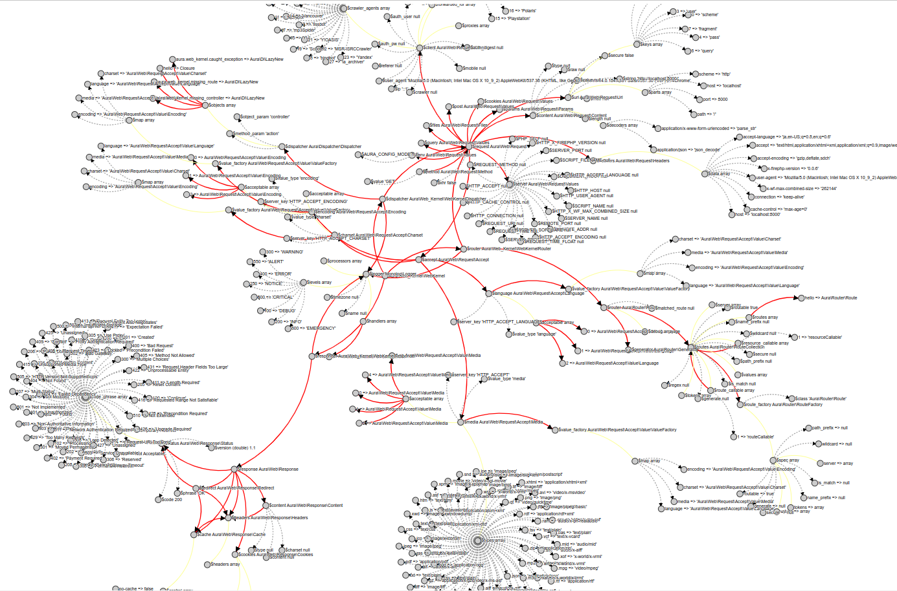

# Почему Раст стал таким, каким стал?

1. Почему на Расте невозможно ничего сделать, не прочитав какой-нибудь талмуд?
2. Почему у Раста такой шумный синтаксис?
3. Почему боров чекер такой душный, даже когда у меня 1 поток?
4. Почему в Расте нет исключений?
5. Почему Раст так долго компилируется?
6. Почему в Раст не завезли ООП и как вообще писать без ООП?


## Почему на Расте невозможно ничего сделать, не прочитав какой-нибудь талмуд?

Раст это действительно _новый_ язык программирования, с которым интуиция в множестве случаев просто молчит. 

В то время как Java можно мыслить как сильно упрощённый и причёсанный Си++,
C# ощущается просто как Java, только где некоторые дилеммы решила за вас компания Microsoft;
Или там Python, Ruby, PHP можно рассматривать как один язык (язык с динамической типизацией,
изменяемыми объектами и сборкой мусора);
Golang это в принципе Java, только с бесплатными (нет) потоками и без ООП-шных заморочек.

А Раст действительно содержит вещи, доселе не присутствовавшие нигде, я говорю прежде всего о концепции владения,
времён жизни и боров чекере.

Из-за этого простейший код, который без проблем поедал Си в Rust вероломно отвергается:
```
let x = "Hello".to_string();
do_something(x);
print!("{x}"); // почему он ругается?
```
Нетривиальная вещь здесь такая, что `do_something` "пожирает" `x`, и это как будто бы побочный эффект, причём по-началу довольно неожиданный.
То, что мы привыкли делать в Java, свободно развешивая ссылки на часть значений просто для удобства, в Расте (оказывается) может приводить
к ошибке компиляции, потому что так просто развешивать ссылки на что попало нельзя. Боров чекер всегда блюдёт инвариант: ссылка никогда не
должна жить дольше значения, на которое она указывает.

```javascript
class Base {
  a() { }
  b() { }
}
class A extends Base {
  a() { console.log("class A") }
}
class B extends Base {
  b() { console.log("class B") }
}
```

Когда мы пытаемся сделать что-то привычное в духе
"Базовый класс содержит методы `a` и `b`, производный класс `А` переопределяет метод `а`, 
а производный класс `B` переопредляет `b`", то вдруг
обнаруживается, что нет никаких базовых классов и производных классов и как писать пользовательские абстракции - неочевидно.
Потом обнаруживаем штуку, которая называется _trait_ ("типаж"), но это какая-то штука из Haskell и не очень похожа на класс.
Об ООП мы поговорим чуть позже.

Когда мы пытаемся прийти в Раст из ФП, то, к счастью, обнаруживаем наши любимые алгебраические типы данных и 
сопоставление с образцом (паттерн-матчинг), но с функциями творится какая-то фигня, хочется, например,
передать функцию в функцию и потом вернуть композицию, но Раст как будто бы излишне усложняет подобные задачи.

Попытка сделать структуру данных тоже оказывается не так легко, Раст не даёт сделать казалось бы простейшие вещи.
Попытка реализовать привычные типы данных вроде двусвязных списков порождают невероятное количество граблей,
по которым больно ходить.

В-общем, получается так, что для программиста, привыкшего к обычным языкам Раст мешает программировать!

Поэтому, я бы хотел призвать тех, кто только загорелся - не уничтожать свой энтузиазм раньше времени и пройти 
какой-нибудь обучающий этап (чтение Rust Book или TMLL) прежде, чем браться создавать какой-то более-менее сложный проект.


## Почему у Раста такой шумный синтаксис?

На синтаксис языка Rust повлияло множество языков:

* SML, OCaml: алгебраические типы данных, сопоставление с образцом, вывод типов, точки-с-запятой
* C++: ссылки, RAII, умные указатели, семантика перемещения, мономорфизация, модель памяти
* ML Kit, Cyclone: управление памятью на основе регионов
* Haskell (GHC): классы типов, семейства типов
* Newsqueak, Alef, Limbo: каналы, конкурентность
* Erlang: обмен сообщениями, ошибки потоков, связанные ошибки потоков, легковесные потоки
* Swift: опциональные биндинги
* Scheme: гигиенические макросы
* C#: атрибуты
* Ruby: синтаксис замыканий
* Unicode Annex #31: синтаксис идентификаторов и образцов

Взято [отсюда](https://doc.rust-lang.org/reference/influences.html)

Претензия к шумному синтаксису - это частая претензия от людей, которые переходят на Rust после Python, Haskell или Java.
Обычно приводятся фрагменты типа такого:
```rust
pub fn read<P: AsRef<Path>>(path: P) -> io::Result<Vec<u8>> {
  fn inner(path: &Path) -> io::Result<Vec<u8>> {
    let mut file = File::open(path)?;
    let mut bytes = Vec::new();
    file.read_to_end(&mut bytes)?;
    Ok(bytes)
  }
  inner(path.as_ref())
}
```
(этот код взят из [статьи тов. Matklad](https://matklad.github.io/2023/01/26/rusts-ugly-syntax.html))

Проблема здесь не только в том, что разработчики выбрали слишком много знаков пунктуации, а главным образом в том,
что на языке системного уровня приходится учитывать множество деталей, которые никак не проявляются в языках высокого
уровня. Вот этот фрагмент отражает множество моментов:
1. В функцию `read` можно передавать в параметр `path` множество типов, конвертируемых к `&Path`
2. Внутренняя функция `inner` необходима для избегания раздувания кода в результате компиляции
3. Сложный возвращаемый тип необходим для описания типа ошибки, в отсутствие исключений
4. `file.read_to_end(&mut bytes)` это сообщение компилятору (и читателю) о том, что здесь передаётся _изменяемая_ ссылка на `bytes`, 
таким образом боров чекер сможет пресечь некорректное появление других ссылок на этот объект

Если представить, что все эти детали неважны, и у нас нет никакого боров чекера, есть сборщик мусора и исключения, то
этот код может быть таким
```rust
pub fn read(path: Path) -> Bytes {
  let file = File::open(path);
  let bytes = Bytes::new();
  file.read_to_end(bytes);
  bytes
}
```
Как видим, он значительно похудел. Но наблюдатель, возможно, скажет, что для ещё большей гармонии
1. Избавиться от `;` на концах строк
2. Сделать так, чтобы `File::open(path)` выглядел как `File.open(path)`
3. Сделать так, чтобы не были нужны `let` 

### 1. Избавиться от `;` на концах строк

Что можно сказать по первому пункту? Разработчики Rust конечно смотрели на Javascript, Scala, Python и Haskell - языки,
где разделяющие точки-с-запятой не являются необходимыми, и все они (за исключением Haskell) страдают от такой вещи:
- Случайный перевод строки в какой-то конструкции может изменить логику вычисления
- В expression-based языках выражение ниже строчкой может расцениваться как продолжение выражения выше и тем самым
нежелательным образом удлинить время жизни объектов

Пример в js:
```js
return
  a + b
```
Пример в гипотетическом Rust без точек-с-запятой:
```rust
fn test1() {
    a
    [b] // a[b] или a; [b], сколько будет жить a?
}
fn test2() {
    a
    ::b // a::b или a; ::b?
}
fn test3() {
    a
    - b // a - b или a; -b ?
}
fn test4() {
    break
    a // break a или break; a?
}
```
Аналогичные примеры можно привести и для других языков, иногда спасает статическая типизация, что после такого
разбиения перестают сходиться типы. Тем не менее, это большое неудобство, когда программа после автоматического
форматирования вдруг может изменить поведение. С помощью эвристик и усложнения компилятора удаётся
подобные проблемы решить (например, в Scala и Kotlin, но там не решаются проблемы со временами жизни, и иногда
требуется явное указание возвращаемого значения и обрамление в скобки) 

Таким образом разработчики Rust решили не усложнять жизнь себе эвристиками, а просто ввели железное правило:
* `expr` вычисляет выражение и возвращает вычисленное значение
* `expr;` вычисляет выражение, отбрасывает вычисленное значение и возвращает `()`

Главное тут в том, что `;` это не разделитель, а синтаксис для преобразования значения в `()` 
(в Haskell есть функция `void :: Functor f => f a -> f ()`, так вот `;` это она)

Разработчики Rust понимали, что привнесение `;` вызовет неудобство при написании кода, но в целом, как мне думается, 
важнее сохранить следующее свойство: после того как вы вставили кусок кода и применили форматирование, поведение должно 
гарантированно оставаться прежним.

### 2. Сделать так, чтобы `File::open(path)` выглядел как `File.open(path)`

Есть два разделителя `::` и `.`, и возникает вопрос, почему бы вместо `::` не использовать всегда `.`?
Увы, это невозможно, как показывает следующий фрагмент: 
```rust
struct T {}
impl T {
    fn is_some() {}
}
fn main() {
    let T = Some(1);
    T::is_some(); 
    T.is_some(); // вызов Option::is_some(&T)
}
```
Типажи (traits) это важная часть системы типов Rust, использование типажей позволяет писать обобщённый код достаточно
просто и отказаться от синтаксиса вызова методов очень неприятно:
```rust
trait HasArea {
    fn area(&self) -> f64;
}

fn print_area<T: HasArea>(shape: T) {
    println!("This shape has an area of {}", shape.area());
    println!("This shape has an area of {}", HasArea::area(&shape)); // meeeeh
}
```
Таким образом, для доступа по модулям и пространствам имён должен иметь один разделитель, а для доступа
к полям и методам -- другой. Теоретически можно было поэкспериментировать с такими:
```rust
fn test() {
    let mut current_path = std::env::current_dir().map_err(|_| Error::File("..."))?;

    let mut current_path = std:env:current_dir().map_err(|_| Error:File("..."))?; // Erlang
    let mut current_path = std/env/current_dir().map_err(|_| Error/File("..."))?; // Nim
    let mut current_path = std$env$current_dir().map_err(|_| Error$File("..."))?; // java bc
    let mut current_path = std-env-current_dir().map_err(|_| Error-File("..."))?; // :-)
    let mut current_path = std^env^current_dir().map_err(|_| Error^File("..."))?; // ^_^
}
```
В целом вариант с `::` нормальный, возможно после других языков будет некоторое неудовольствие, но привыкнуть можно.


### 3. Сделать так, чтобы не были нужны `let`

Пока оставим в стороне Python, в котором создание переменной возможно просто "из воздуха", например опечатавшись в имени.

Возьмём C++, где в декларации сначала идёт тип, а потом название переменной. Проблема в том, что тип может быть
достаточно сложный и может быть достаточно хлопотно прочитать такое объявление:
```cpp
Framed<FramedWrite<WriteHalf<TcpStream>, LengthDelimitedCodec>, Request, SomeType1, SomeType2> requests = ...;
Framed<FramedRead<ReadHalf<TcpStream>, LengthDelimitedCodec>, Response, SomeType1, SomeType2> responses = ...;
```
Способ Rust вкупе с выводом типов позволяет регулировать сложность подобных объявлений объектов:
```rust
type Requests = Framed<FramedWrite<WriteHalf<TcpStream>, LengthDelimitedCodec>, Request, SomeType1, SomeType2>;

fn main() {
    let requests = ...; // если вывод типов полностью справляется
    let requests: Framed<_, _, _, _> = ...; // если надо немного помочь
    let requests: Framed<_, Request, SomeType1, SomeType2> = ...; // если надо чуть больше помочь
    let requests: Requests = ...; // если хочется вообще замести тип под ковёр 

    // часто можно помочь с помощью т.н. turbofish
    let vec = a_collection.iter().map(|x| ...).collect::<Vec<_>>();
}
```
Кстати, синтаксис лямбды `|x| f(x)` пришёл из Ruby


Есть ещё один неприятный аспект для варианта, когда в синтаксисе языка нет `let` или подобных ключевых слов. 
Например, в случае C++ есть неопределённость для парсера:
```сpp
template<typename T> class X {
    void foo() {
        T::A* pa;
        // typename T::A* pa; 
    }
} 
```
Здесь проблема в том, что компилятор C++ не может однозначно распарсить `T::A * pa`, потому что он не знает, что такое `T::A`,
это умножение или определение указателя. В компиляторах C++ уже на уровне лексического анализа применяются "хаки", чтобы
избежать этой неоднозначности.

Наконец, (что, правда, касается конкретно C/C++) попробуйте прочитать эти штуки! Я когда-то не только помнил, но даже понимал
логику, но теперь уже это знание выветрилось и я не скажу, что я сильно обеспокоен этим :-)
```cpp
int (*(*foo)(void))[3]
void (*signal(int sig, void (*func)(int)))(int)
char * const (*(* const bar)[5])(int )
```

Если что https://cdecl.org/ в помощь

### В качестве вывода

Синтаксис Rust был обусловлен не какими-то странными вкусами разработчиков, а рядом существенных его свойств:
1. Статическая типизация с выводом типов (`let x: T = v`)
2. Контроль времени жизни объектов (`;`)
3. Продвинутая типизация с использованием типажей (traits) как ограничений на типы-параметры
4. Выбор в пользу скорости исполнения (следовательно, нужна мономорфизация)
5. Отсутствие исключений и выбор в пользу типов Result и Option (`?`)
6. Влияние многих других языков на Rust, где разработчики переняли опыт других
7. В некоторые моменты был выбран синтаксис коллегиально (`'a`, `async_call().await`, HRTB)

```rust
fn apply_to_all<F>(xs: &[String], f: F) 
where
    F: for<'a> Fn(&'a str) -> &'a str,
{
    for s in xs {
        println!("{}", f(s));
    }
}
fn main() {
   let xs = vec!["hello".to_string(), "world".to_string()];
   apply_to_all(&xs, |x| {
      if x.len() > 4 { x } else { "short" }
   });
}
```

## Почему боров чекер такой душный, даже когда у меня 1 поток?

Многие согласятся, что если вы осуществляете изменяемый доступ из нескольких потоков, то это необходимо контролировать.
Rust тут хорош тем, что он это контролирует на этапе компиляции:

```rust
use std::sync::{Arc, Mutex};
use std::thread;

fn main() {
    let mut counter = 0;
    let mut handles = vec![];
    for _ in 0..10 {
        let counter_ref = &mut counter;
        let handle = thread::spawn(move || {
            *counter_ref += 1;
        });
        handles.push(handle);
    }
    for handle in handles {
        handle.join().unwrap();
    }
    println!("Result: {}", counter);
}
```
Здесь делается попытка инкрементировать counter из 10 потоков, идём по циклу, на каждой итерации заводим
изменяемую ссылку на counter и через эту ссылку увеличиваем его. Хендлы потоков, которые только что стартовали,
кладём в массив handles и дожидаемся, пока они все завершатся. После этого печатаем счётчик, и ожидаем, что
его значение будет 10.

Однако Rust выдаст ошибку "`counter` does not live long enough", что, после пристального вглядывания, становится понятно.
Если сделать аналогичный код на Джаве или Го, то counter в конце вполне может получиться не 10.

Ключевая проблема в том, что на counter заводится несколько изменяемых ссылок и через эти ссылки counter изменяется
неконтролируемо, это можно решить несколькими способами:
1. Развить интуицию у программиста выявлять такие паттерны в коде, где осуществляется мутация из нескольких потоков
2. Снабдить программиста инструментами выявления гонок данных, пример `go run -race main.go`
3. Пресекать такие ситуации на уровне системы типов

В Rust был сделан выбор в пользу 3 и это замечательное решение. Однако это порождает неудовольствие, когда, например,
на Leetcode, где всё однопоточное, но пользователь сталкивается с ограничением Rust:
```rust
fn main() {
    let mut a = 42;

    let b = &a;
    let c = &mut a;

    println!("{a}, {b}, {c}");
}
```
error[E0502]: cannot borrow `a` as mutable because it is also borrowed as immutable

Это кажется, _WTF, что за оверкилл_, тут же никаких гонок данных, всё безопасно и прочее.

Однако нужно вспомнить следующее: Rust это низкоуровневый язык без сборщика мусора, и, следовательно, через
изменяемую переменную можно изменить какую-нибудь структуру данных, при этом существующие ссылки (если бы такие были)
оказались бы повисшими в воздухе. Таким образом стоит чуть-чуть усложнить этот пример, и мы получим некорректную
программу:
```rust
fn main() {
    let mut a = vec![1, 2, 3];

    let b = &a;
    let c = &mut a;
    let d = &a[0]; // вешаем указатель на первый элемент 
    c.clear();     // удаляем все элементы в векторе

    println!("{a}, {b}, {c}");
}
```
В языках со сборкой мусора это не приведёт к падению, потому что d будет ссылаться на старый объект, который существовал
до вызова `c.clear()` и проблема инвалидации итераторов там в худшем случае может привести к исключению.

В Rust подобные вещи (итерация по изменяемой коллекции) делаются через Interior Mutablity, индексы, структурированием
или созданием специализированной структуры данных. 

Структурированием это примерно так: скажем, итерируемся и собираем изменения в отдельную коллекцию, после этого применяем.
```rust
enum Op {
    Incr(usize),
    Decr(usize),
}

fn main() {
    let mut arr = vec![1, 2, 3];
    let mut changes = Vec::new();
    // eval
    for (i, a) in arr.iter().enumerate() {
        if *a % 2 == 0 {
            changes.push(Op::Incr(i));
        } else {
            changes.push(Op::Decr(i));
        }
    }
    // apply
    for ch in changes {
        match ch {
            Op::Incr(i) => arr[i] += 1,
            Op::Decr(i) => arr[i] -= 1,
        }
    }

    println!("{arr:?}"); // выведет [0, 3, 2]
}
```
Возможно, чутьё некоторых читателей здесь подскажет что-то очень знакомое. Да, это на самом деле зачатки очень мощной
техники программирования и комментарии `eval` и `apply` здесь неспроста. Здесь я делаю отсылку к широко известной
в узких кругах книге [SICP](https://en.wikipedia.org/wiki/Structure_and_Interpretation_of_Computer_Programs). 
Тип `Op` потенциально может быть довольно сложным, настолько, что представлять AST
некоторого языка, `apply` может быть частично выражен через `eval`, а `eval` -- частично через `apply`, в итоге
это порождает возможность свободной интерпретации структуры данных, что в свою очередь позволяет
создавать гибкую логику с возможностью тестировать её на разных уровнях.

Создание специализированной структуры данных я здесь описывать не буду, это сопряжено с серьёзным погружением в
`unsafe`, проблему UB, тщательным тестированием с использованием MIRI и вообще это достаточно сложная тема.
Для интересующихся порекомендую небольшую книгу _Learn Rust With Entirely Too Many Linked Lists_, её легко найти онлайн
и она не только полезная для понимания, но и очень интересна. Я в первый раз её читал как хороший детектив! :-)


## Почему в Расте нет исключений?

Исключения это вещь небесплатная, само исполнение кода, даже когда никакие исключения не бросаются, трудно сделать
эффективным, если уже включена поддержка их. Насколько мне известно, в C++ удалось сделать, что поддержка исключений
была почти бесплатная, но всё же, когда исключения бросаются и ловятся, особенно в циклах, это уже не только не
бесплатно, но и достаточно дорого.

Обработка исключений требует поддержки не только компилятора, но и среды выполнения.

Кроме того, не все исключения одинаково легко обработать, например в Java обработка OutOfMemoryException может быть
сопряжена с аллокациями памяти, что в свою очередь может тоже породить OutOfMemoryException и всё это скорее всего
закончится падением. Поэтому джависты вынуждены заморачиваться с тем, чтобы некоторые исключения перехватывать, а некоторые
отпускать наверх, упали -- так упали.

Исключения также порождают альтернативный поток управления, в том смысле, что есть нормальный, когда функция возвращает
значение, а есть альтернативный -- когда бросается исключение и вызываются обработчик, который не всегда очевидно
где находится и не всегда очевидно когда сработает. 

Из-за этого подобный код вдобавок тяжело читать, например вот   
```
public class HelloGoodbye {
    public static void main(String[] args) {
        try {
            System.out.println("Hello world");
            System.exit(0);
        } finally {
            System.out.println("Goodbye world");
        }
    }
}
```
Тут мы попадаем впросак: напишет ли нам программа "Goodbye world"? С одной стороны мы знаем, что Java всегда, при любых
исключениях или нет, выполняет finally блок, с другой стороны там вроде как выход в блоке try. 
И если мы не можем найти выход в этих трёх соснах, что говорить про большие системы?
Это Паззл #39 из Java Puzzlers, но на практике встречаются и более серьёзные паззлы.

Добавлю, особенно тяжело сочетать исключения с асинхронным или многопоточным кодом. Анализ подобных логов может
растянуться на долгие дни и недели.

Rust разработчики посмотрели на это всё и решили, что все эти сложности явно излишни, и можно оттолкнуться от
простейшей классификации:
1. Неисправимые ошибки
2. Исправимые ошибки
   a. Библиотечные ошибки
   b. Ошибки приложения 

Неисправимые (unrecoverable) ошибки, это такие, которые случились, мы подобного развития сюжета совсем не ожидали
и поэтому не можем с ними ничего сделать. А поэтому самый лучший способ поступить -- просто уничтожить текущий
поток. Иногда нам может потребоваться информация для отладки, в этом случае мы попутно соберём стектрейс.
Примеры: деление на 0, выход за пределы массива, OOM.

Исправимые ошибки это такие, которые поток исполнения так или иначе реализует, пусть даже самым тривиальным образом.
Таких ошибок тотальное большинство: ошибка при открытии файла, ошибка при соединении с базой данных, ошибка парсинга
JSON и так далее и тому подобное.
И вот эти ошибки легко оборачиваются в значение типа Result, если всё нормально, то значение будет содержать Ok(чего-то),
если нет -- значение будет содержать Err(какое-то значение, которое структурно описывает ошибку).

Преимущества:
1. Значения Result отлично композятся, их можно собрать в коллекцию, сериализовать, десериализовать, 
   положить в базу, распечатать для отладки
2. Система типов делает невозможным игнорирование возможной ошибки
3. Значения Result явно получаются после асинхронных вызовов, после чего их можно проанализировать как обычные значения
4. Rust обеспечивает поддержку в виде типов, анализа исчерпывания в `match` и оператора `?`

В сети часто можно видеть холивары "коды возврата vs исключения", так вот Result - это лучшее из двух миров.

```rust
fn read_number_from_file(file_path: &str) -> Result<i32, std::io::Error> {
    let contents = fs::read_to_string(file_path)?;
    let number: i32 = contents.trim().parse()?;
    Ok(number)
}
```
Композиция:
```rust
fn test() {
    let xs = ["11", "22", "33wow"]; 
    let sum: i32 = xs.iter().filter_map(|x| x.parse::<i32>().ok()).sum();
    println!("sum = {sum}");
}
```

Классификация "библиотечные или ошибки приложения" в Rust делаются на уровне библиотек. Для библиотек важно формирование
структурированных ошибок, которые будет удобно разбирать и анализировать, и это позволяет сделать библиотека `thiserror`

Для приложений же зачастую может быть неважно, какие там ошибки летят из-под капота, хочется достаточно просто и красиво
их или разобрать и должным образом отреагировать, вывести в лог или показать пользователю. В этом случае берём библиотеку
`anyhow` или `eyre` / `color-eyre`


## Почему Раст так долго компилируется?

В свете вышеизложенного понятно, что достаточно умному компилятору нужно большое количество времени на семантический
анализ вашей программы, и с этим ничего не попишешь. Однако здесь надо сделать одно важное замечание: наиболее
критичной медленная компиляция является для цикла разработки, когда результат изменения хочется увидеть как можно
быстрее. Касаемо CI это уже не так важно, всё равно там интеграционные тесты, собираются и поднимаются разные докеры
и это в любом случае небыстро, а вот для разработки нужно сократить время сборки.

_Мономорфизация_ это способ компилировать полиморфный код, создавая специализированный вариант для каждого типа:
```rust
pub fn read<P: AsRef<Path>>(path: P) -> io::Result<Vec<u8>> {
  fn inner(path: &Path) -> io::Result<Vec<u8>> {
    let mut file = File::open(path)?;
    let mut bytes = Vec::new();
    file.read_to_end(&mut bytes)?;
    Ok(bytes)
  }
  inner(path.as_ref())
}
```
Здесь применяется трюк для уменьшения накладных расходов на мономорфизацию: если бы не было внутренней функции
`inner`, то тело функции дублировалось для каждого типа P, который бы встречался в вызовах этой функции `read`.
В текущем варианте дублируется только конвертация `path.as_ref()` для каждого типа, что естественно заметно дешевле. 

Для оптимизации времени компиляции можно поэкспериментировать со следующими приёмами:
1. Крейты компилируются параллельно
2. Применение нового компоновщика MOLD ускоряет один из тяжёлых шагов
3. Попытайтесь снизить накладные расходы на мономорфизацию
4. Попытайтесь снизить накладные расходы на макросы, особенно сложные процедурные макросы. Если невозможно, то разбить на крейты
5. Для экспериментирования с кодом выделить рабочую функцию или типаж в отдельный файл
6. Jupyter notebook https://github.com/evcxr/evcxr
7. Scripting: Rhai, Rune, Lua, Koto; в некоторых случаях Python и JS
   - бенчмарки https://github.com/khvzak/script-bench-rs


## Почему в Раст не завезли ООП и как вообще писать без ООП?

В это трудно поверить, но когда-то в Расте были и классы, и GC!

Что вообще такое ООП? Это подход к созданию программ такой, что 
программа рассматривается как множество взаимодействующих объектов,
каждый из которых обладает своим (возможно неуникальным) поведением, 
объекты взаимодействуют через посылку сообщений и это единственный способ взаимодействия.
(Erlang как будто бы идеально отражает эту модель).

Из наблюдения за реальными системами, написанными в ОО стиле, можно видеть, что:
1. Объекты суть экземпляры классов, классы принадлежат какой-то иерархии (возможно, просто реализуют интерфейсы);
2. Объекты обладают состоянием в виде набора полей;
3. Объекты обладают поведением в виде набора методов, методы примотаны изолентой к состоянию, состояние неверсионированное.
4. Объекты ссылаются друг на друга, граф имеет циклы;
5. Большинство классов бизнес-логики изменяемы, моделирование отражается как изменение состояния, неизменяемыми
делаются только классы, отвечающие за данные (база, сеть);
6. Функциональный подход ограничивается конвертацией коллекций с помощью стримов; дальнейшее углубление ФП
(Tagless Final, Free Monads, эффекты) невозможно;
7. Набор методов реализован так, что корректность состояния якобы гарантируется (_всегда ли?_), на самом деле гарантии
сильно зависят от контекста и модели вычисления (ломаются при многопоточном, асинхронном, ленивом вычислении). 

Взглянем на граф объектов в типичной системе, построенной на ООП:


Мы видим множество перекрёстных ссылок между объектами. "Соцветия" на периферии -- это какие-то коллекции объектов.

Отсюда легко видеть, почему системы, построенные на ОО-подходе не могут быть неизменяемыми.
Представим, что объект должен изменить
состояние. В неизменяемом мире мы не можем просто взять и поменять, мы делаем его копию с новым состоянием.
Затем мы должны также "обновить" состояние у всех объектов, которые зависят от начального, то есть сделать
их копии. И затем эта волна пересозданий распространится до всех транзитивных зависимостей, пока больше не останется
таких объектов. В сущности это означает что? Это означает пересоздание графа объектов на каждое изменение.
Если, например, у нас есть какая-то структура данных (скажем список), мы туда добавляем элемент и должны корректно
обновить все ссылки, которые увязывают прежний список с новым элементом.

Создатель языка программирования Erlang Джо Армстронг когда-то сказал так:
> Вы хотели всего лишь банан, а получаете гориллу с бананом, сидящей на пальме, пальму, растущую в джунглях, и целые джунгли в придачу.

Разумеется это ужасно неэффективно, и так никто не делает, в лучшем случае доходят до (изменяемых) коллекций неизменяемых объектов.
Иногда делают неизменяемые коллекции, но не больше. (Это ответ на теоретическую возможность делать ФП в ООП,
дизайн ФП систем значительно отличается).

### Типичное использование объектов нарушает основной инвариант Rust

То есть большинство объектов изменяемы, и имеет место достаточно бесконтрольное развешивание ссылок на изменяемые
объекты. И что это значит для Rust? Это значит, что нарушается основной инвариант:
либо одна мутабельная ссылка, либо множество иммутабельных ссылок!

### Типажи не участвуют в иерархии наследования

Вторая проблема, которая появляется у классического ООП - это типажи. Типаж - это некоторый интерфейс, который
можно "приклеить" к уже существующей структуре данных. Такая структура данных может быть определена не вами и
находиться в какой-то сторонней (или стандартной) библиотеке.
Это опять же требует явного доступа к структуре данных как некоторой целой единицы.

По-видимому, отсюда у создателей и появилась идея не прятать состояние, а, наоборот, вынести его наружу и позволить
самому компилятору отслеживать корректность использования состояния, изменяемость или неизменяемость его.

Методы, будучи отклеенными от состояния превращаются просто в функции. Некоторые функции реализуют типажи, некоторые
получаются просто как свободные функции, работающие над графом объектов.

### Если не ООП, то как?

1. Вы формулируете описание данных в виде `struct` и `enum`, это структуры данных;
2. Вы определяете функции, которые работают над этими данными, то бишь алгоритмы;
3. Где-то в `main` вы создаёте структуры данных и передаёте их в функции в нужном порядке, вуаля!

Подождите-ка, это что, _процедурное программирование_?!

В целом похоже, но это делается на новом, типобезопасном витке развития технологии:
1. В ООП классы скрывали состояние, чтобы его случайно не испортили внешние объекты. В Rust это достигается 
видимостью на уровне модуля и владением данных или мутабельностью ссылок на данные.
2. Методы распадаются на: методы, ассоциированные с данными, методы типажей и внешние функции. 
3. Наследования реализации нет, для типажей есть "наследование" cигнатур функций.
4. Функции, которые работают с данными, могут обобщёнными, равно как и типажи, и типы данных.

```rust
pub trait Summary {
    fn summarize(&self) -> String;
}

pub struct NewsArticle {
   pub headline: String,
   pub location: String,
   pub author: String,
   pub content: String,
}

impl NewsArticle {
   fn mutate_news(&mut self, mut rng: impl Rng) { ... } 
}

impl Summary for NewsArticle {
   fn summarize(&self) -> String {
      format!("{}, by {} ({})", self.headline, self.author, self.location)
   }
}

pub struct SocialPost {
   pub username: String,
   pub content: String,
   pub reply: bool,
   pub repost: bool,
}

impl SocialPost {
   fn make_post(mut rng: impl Rng) -> Self { ... }
}

impl Summary for SocialPost {
   fn summarize(&self) -> String {
      format!("{}: {}", self.username, self.content)
   }
}

// обобщённая функция, работающая с любым T, статическая диспетчеризация
pub fn notify<T: Summary>(item: &T) {
   println!("Breaking news! {}", item.summarize());
}

// обобщённая функция, работающая с любым T, динамическая диспетчеризация
pub fn notify_dyn(item: &dyn Summary) {
   println!("Breaking news! {}", item.summarize());
}
```
