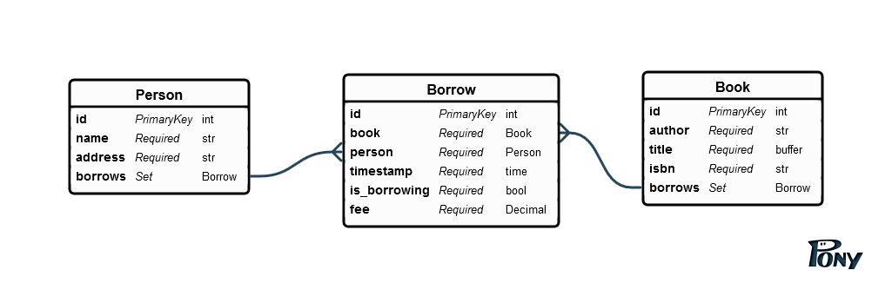

# Задачи по семинару 'Моделирование данных в Кассандре'

## Постановка задачи

Пусть у нас есть перенаселённый город будущего Н, где после войны с машинами интернет стал рискованным и очень дорогим занятием,
и люди вернулись к старому доброму чтению нормальных бумажных книжек.
Горожане однако предпочитают не покупать книги, а брать "напрокат", это намного дешевле и не требует больших шкафов для хранения книг.
И вот, руководство Большого Книжный Магазина видя, что доходы от продажи книг стремительно упали, решило сместить акценты в бизнесе и
за небольшую плату давать людям книжки на "почитать".
Оно закупило заодно серверной вычислительной техникой с Кассандрой самой последней версии и всё это объединили в кластер.
И - о чудо - там оказались вы. Вам предстоит наладить учёт информации о пользователях, книгах и процессе проката.

## Схема базы данных

Схема более-менее очевидна. Единственный момент - когда пользователь берёт книгу, `is_borrowing` ставится в `true` и `fee` 
- это плата за пользование. Когда возвращает - `is_borrowing` становится в `false`, `fee` получает дефолтное значение 0.

## Задание 1

Опишите (в свободной форме на русском языке, если надо со стрелочками и кружочками)
какие _column families_ вы создадите при условии, что требуются следующие операции:

1. Внести пользователя в реестр
2. Внести книгу в реестр
3. Сделать отметку об отдаче книги на временное пользование, взяв у него N руб
4. Сделать отметку о моменте возврата
5. Найти, сколько пользователей брали книжки за какой-то календарный месяц
6. Найти, сколько книг брали пользователи за какой-то календарный месяц

## Задание 2

Как изменится схема и вообще какие изменения потребуются, если

1. Нужно найти злостных "невозвращенцев", то есть людей, которые держат книги больше X дней.
2. Руководство решит активным пользователям сделать скидки.

